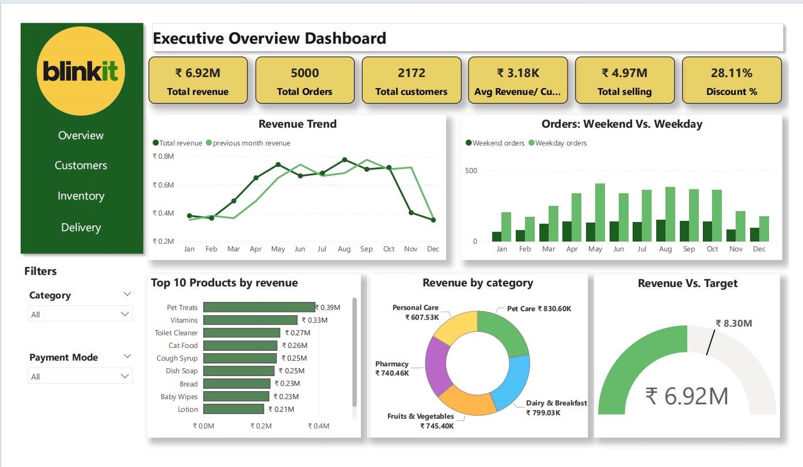
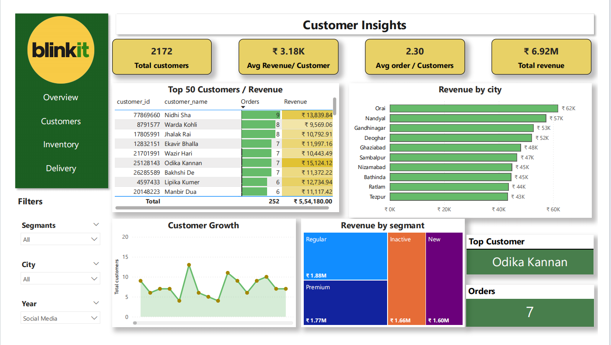
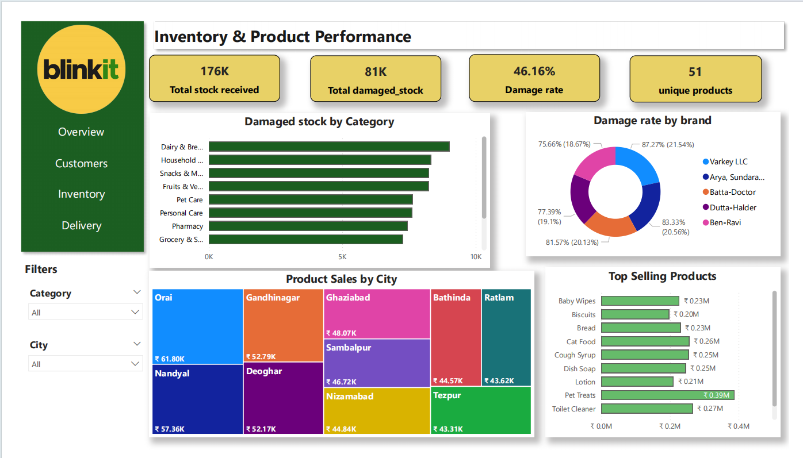
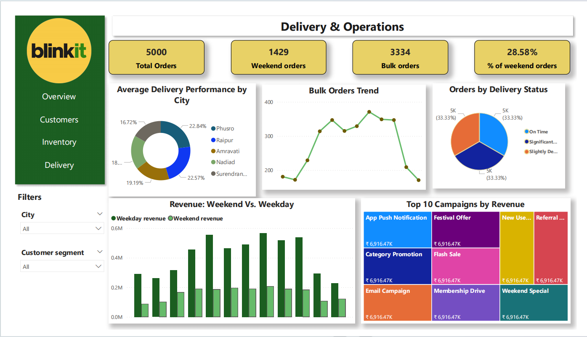

# Blinkit Sales Analysis Dashboard

## Overview
This project is an interactive Power BI dashboard built using the Blinkit sales dataset from Kaggle.
The dashboard analyzes sales, customers, inventory, and delivery performance to provide business insights across different categories, cities, and customer segments.

## Tools Used
- Power BI
- Power Query
- DAX
- Kaggle Dataset

## Dataset
Source: Kaggle – Blinkit Sales Dataset

## Dashboard Pages

### Executive Overview
- Total Revenue
- Total Orders
- Total Customers
- Average Revenue per Customer
- Revenue Trend
- Revenue vs Target
- Top 10 Products by Revenue

### Customer Insights
- Top Customers by Revenue
- Revenue by City
- Customer Growth
- Revenue by Segment

### Inventory & Product Performance
- Total Stock Received
- Damaged Stock
- Damage Rate
- Top Selling Products
- Product Sales by City

### Delivery & Operations
- Delivery Performance by City
- Orders by Delivery Status
- Weekend vs Weekday Revenue
- Top Campaigns by Revenue
- Bulk orders trend

## Key Insights
- Total revenue reached ₹6.92M.
- Regular customers generate the highest revenue.
- Inventory damage rate is 46.16%.
- Weekend orders account for 28% of total orders.
- Campaigns contribute significantly to revenue growth.

## Project Structure
Blinkit_Sales_Analysis_PowerBI/
├── Data/
├── Report/
├── Screenshots/
|── README.md

## Dashboard Preview

## How to Use
1. Download or clone this repository.
2. Open the `.pbix` file in Power BI Desktop.
3. Refresh the data if required.

## Skills Demonstrated
- Data Cleaning
- Data Modeling
- DAX Measures
- KPI Creation
- Dashboard Design
- Business Analysis

## Disclaimer
This project was created for learning and portfolio purposes using a public dataset from Kaggle.
